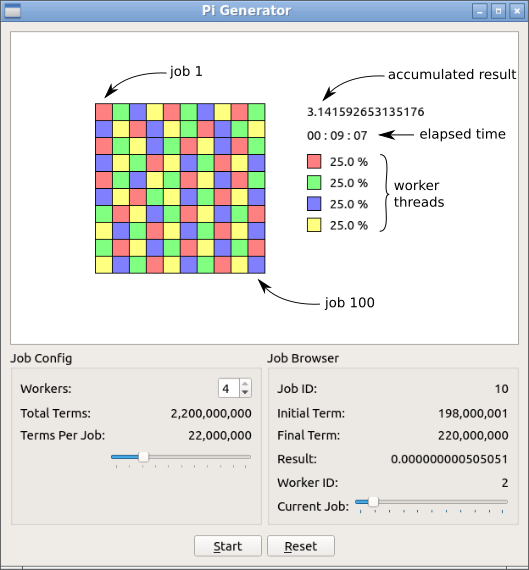

# Pi Generator

This program generates Pi up to a certain amount of correct digits.

It was implemented in C++ and Qt 5.8 using QtCreator running on Lubuntu 17.04 (64 bits)

This a way to exemplify how a main task can be split in smaller independent tasks that can be executed in separate threads concurrently.

Pi is generated in this case by means of the [Leibnitz's Formula](https://en.wikipedia.org/wiki/Leibniz_formula_for_%CF%80)

## Main Window Explained

## Usage
The whole calculation is split always over 100 jobs. 

The number of correct digits of the end result depends on the amount of terms used for the whole calculation.

The more terms are used per job, the more accurate the end result will be, which can be adjusted using the **Terms Per Job** slider.

The amount of worker threads can be adjusted using the **Workers** spin box on the **Job Config** panel.

The elapsed time for the whole calculation is shown below the accumulated result.

On the **Job Browser** panel the partial results given by each job can be viewed using the **Current Job** slider.

The **Start/Stop** button controls the calculation.

The **Reset** button resets the calculation.

## Inner Workings
When the application starts the workers are set up and 100 jobs are created and queued on the **jobs** queue. Then the GUI elements are also set up.

When the calculation is started, one job is assigned to each worker sequentialy and then asyncronously as each worker reports its end result, a new pending job is assigned to it from the **jobs** queue until all the jobs have been processed.

As all jobs have been processed the calculation end, and the elapsed time stops.

The calculation can be stopped and reset at any time.
